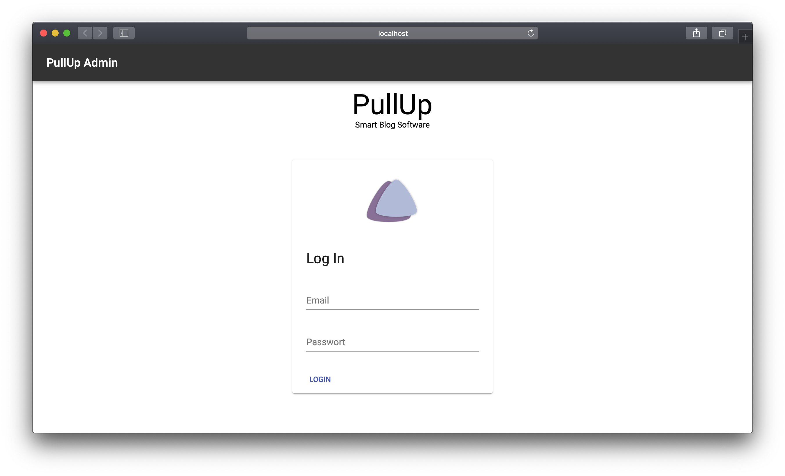
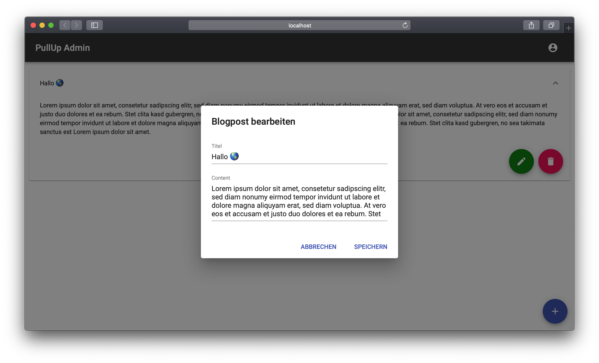

# PullUp Admin Dashboard

Das ist das Dashboard für PullUp. Eine Native Blog App.
Das Dashboard ist mit React JS und Firebase als Backend programmiert.
Man kann neue Einträge erstellen, bearbeten und löschen. Um sich ein Konto zu erstellen benötigt man jedoch die Native PullUp App.

